# Sistem Perpustakaan Laravel
Project ini merupakan tugas praktikum Laravel tentang implementasi Routing, View, dan Controller menggunakan konsep MVC (Model View Controller).

- Nama: Najwa Armia Zahra
- NIM: 60324002
  
## Fitur
### Tugas 1 - Routing dan View Anggota
- Menampilkan daftar anggota perpustakaan
  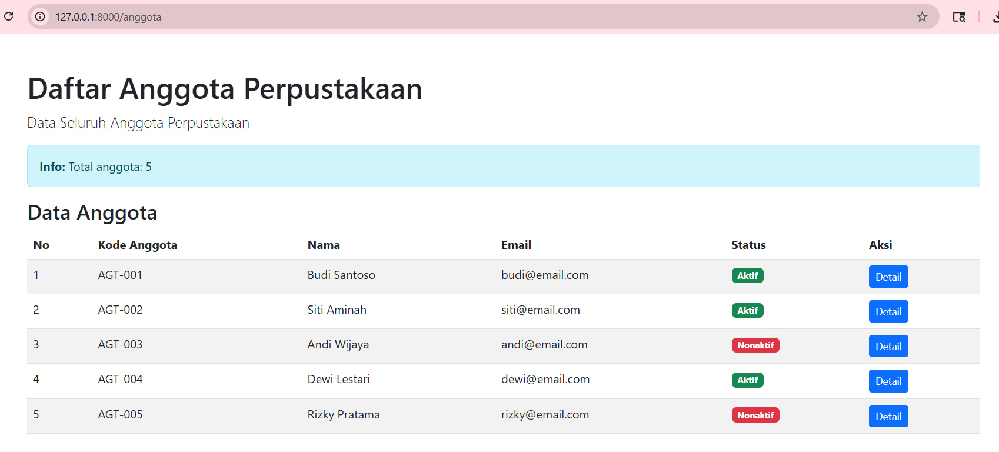
- Detail anggota
  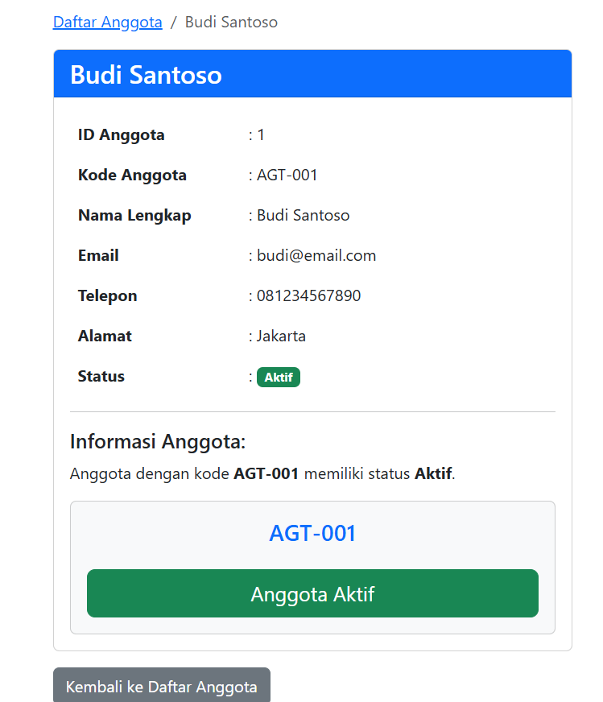
  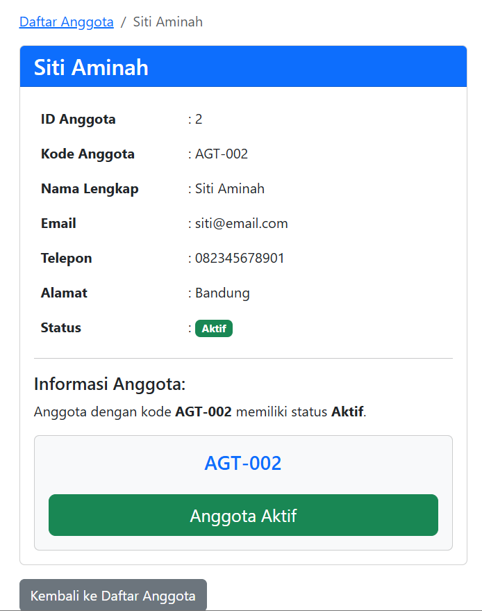
  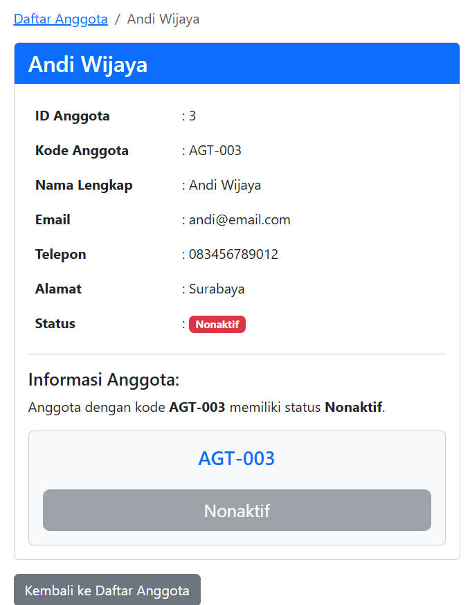
  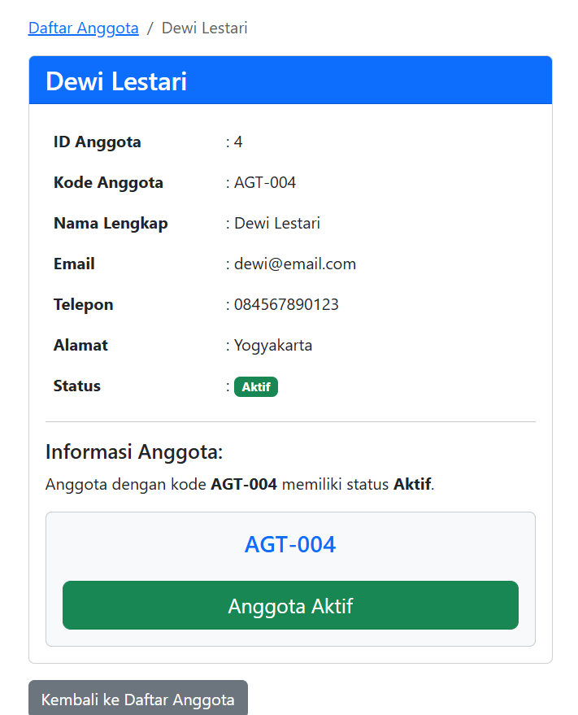
  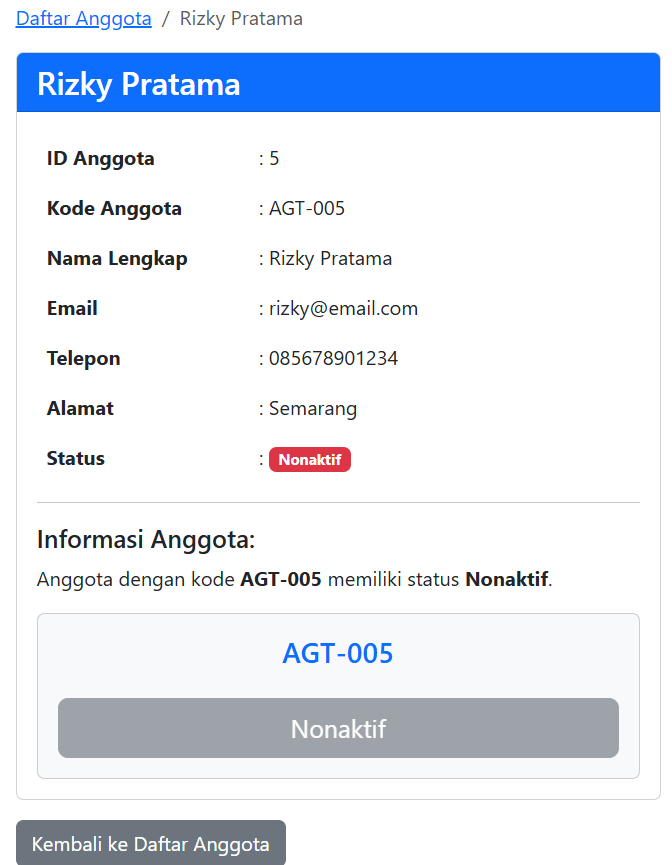

### Tugas 2 - Controller Kategori Buku
- Daftar kategori buku
  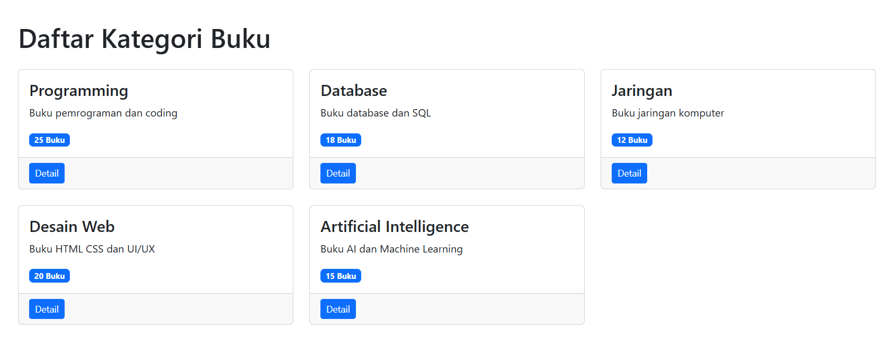
- Detail kategori
  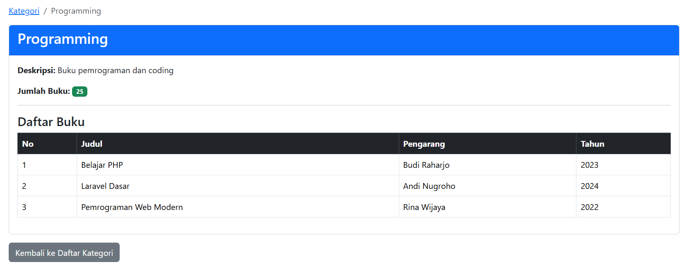
  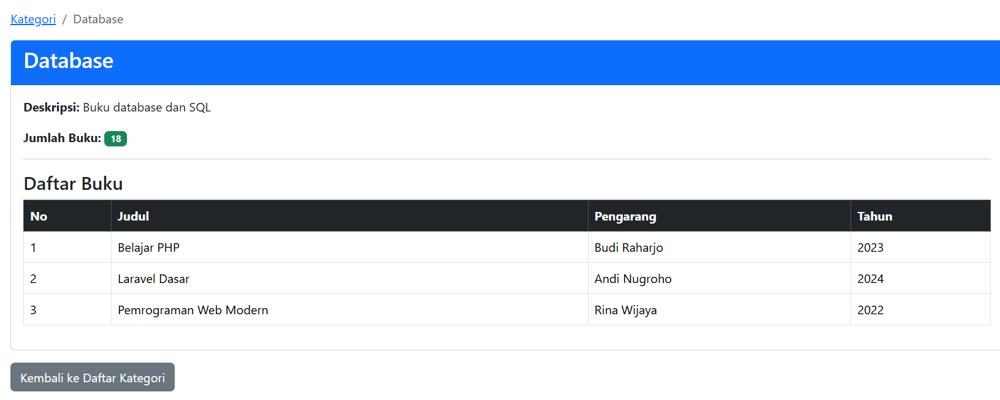
  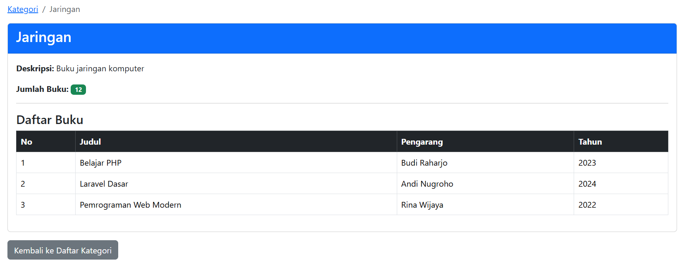
  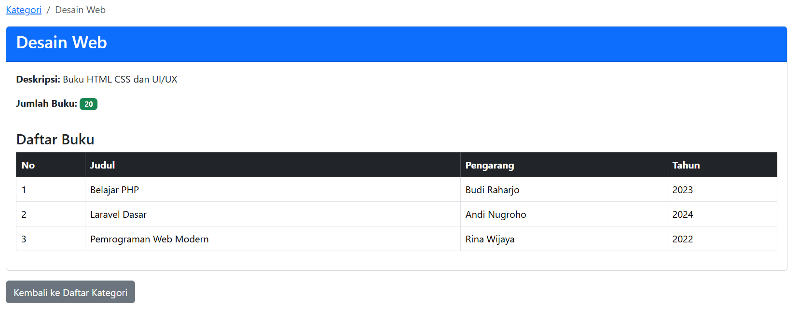
  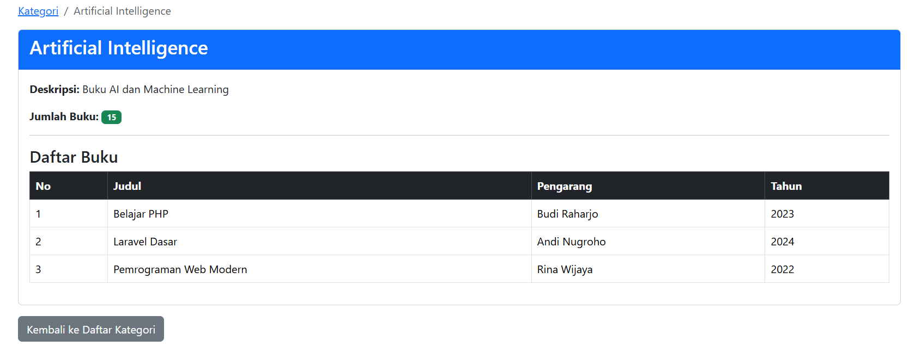

---

# Menggunakan
- PHP 8.3
- Laravel 12
- Bootstrap 5

---
